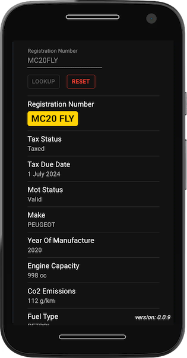
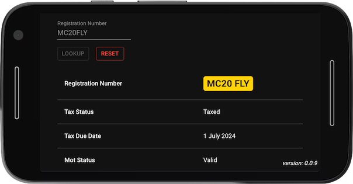

# Description

This is a little React app that uses the Vehicle Enquiry Service (VES) API to lookup vehicle details by registration number.

# Technologies

* Vite
* React
* Material UI
* react-query & axios
* Vitest & React Testing Library & Mock Service Worker
* Cypress & Cypress Testing Library
* GitHub Actions workflows
* Serverless Framework

# TODO

* [x] Display version number in bottom right corner
* [x] Add unit tests using React Testing Library and Mock Service Worker
* [x] Add end-to-end tests using Cypress
* [x] Use GitHub Actions to implement a CI/CD workflow to:
    * [x] Run lint check
    * [x] Run unit tests
    * [x] Run end-to-end tests
    * [x] Deploy to gh-pages

# Screenshots

## Phone (Portrait)

## Phone (Landscape)

# Links

* [Vehicle Enquiry Service (VES) API Guide](https://developer-portal.driver-vehicle-licensing.api.gov.uk/apis/vehicle-enquiry-service/vehicle-enquiry-service-description.html#vehicle-enquiry-service-ves-api-guide)
