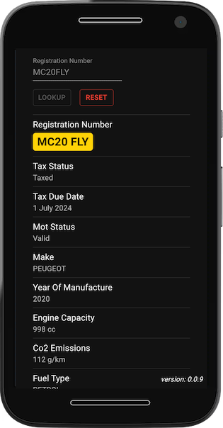
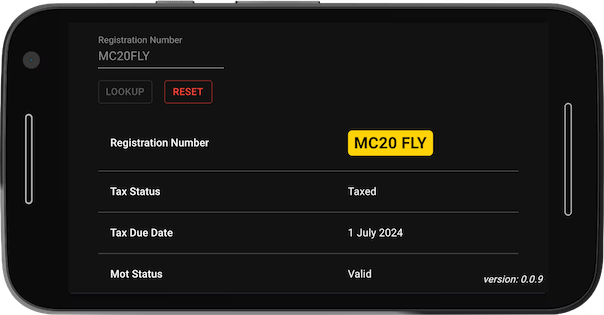

[](https://github.com/taylorjg/dvla-viewer/actions/workflows/ci-cd.yml)

# Description

A React app that looks up vehicle details by registration number via the [DVLA Vehicle Enquiry Service (VES) API](https://developer-portal.driver-vehicle-licensing.api.gov.uk/apis/vehicle-enquiry-service/vehicle-enquiry-service-description.html).

- **Deployed site:** https://taylorjg.github.io/dvla-viewer
- **Backend:** AWS Lambda in [`server/`](server/README.md) (API key stays server-side)

# Development

Frontend (repo root):

```bash
npm ci
npm run dev               # Vite dev server
npm run lint              # ESLint (includes Prettier and jsx-a11y)
npm test                  # Vitest + MSW (includes axe accessibility checks)
npm run test:cypress      # Cypress end-to-end tests (includes axe)
npm run a11y:report       # Lighthouse accessibility score + HTML report (local)
```

The server backend has its own toolchain — see [server/README.md](server/README.md).

# Accessibility

**Target:** WCAG 2.2 Level AA on the **primary user flow** — enter a registration number, view vehicle details, or read an error. This is not a claim of whole-site certification (e.g. the version footer is supplementary).

**What is covered:**

- Semantic landmarks (`main`, `footer`), page headings, and a labelled lookup form
- Keyboard-operable buttons and Enter-to-submit
- Error messages exposed as alerts; async updates in a live region
- Results as an accessible table (desktop) or list (mobile), with row headers
- Focus moves to vehicle details after a successful lookup

**Known limits:** no skip link (single-column layout); backend API is out of scope for frontend a11y.

**Automated checks:**

| Command                | Tool                                             | Runs in CI                                                           |
| ---------------------- | ------------------------------------------------ | -------------------------------------------------------------------- |
| `npm run lint`         | eslint-plugin-jsx-a11y-x                         | yes (`test` job)                                                     |
| `npm test`             | vitest-axe on initial, success, and error states | yes (`test` job)                                                     |
| `npm run test:cypress` | cypress-axe on success and error flows           | yes (`e2e` job)                                                      |
| `npm run a11y:report`  | Lighthouse accessibility category                | no (local only; score 100 on static landing page at time of writing) |

**Manual spot-check** (5–10 minutes): tab through the form and buttons; submit with Enter; confirm results or errors are announced (VoiceOver on macOS or NVDA on Windows); zoom to 200% and confirm the layout remains usable.

# CI

GitHub Actions (`.github/workflows/ci-cd.yml`) runs on every push and pull request:

| Job            | What it runs                                        |
| -------------- | --------------------------------------------------- |
| `test`         | `npm run lint`, `npm test` (frontend, includes axe) |
| `e2e`          | Cypress against `npm run dev` (includes axe)        |
| `server-check` | `cd server && npm run check`                        |

All three jobs are required for merges to `main`.

Deploy to gh-pages runs when a version tag is pushed, after the frontend jobs pass.

Server CI needs repository secrets `API_KEY` and `SERVERLESS_ACCESS_KEY` — see [server/README.md](server/README.md).

# Technologies

- Vite & React
- Material UI
- TanStack Query & axios
- Vitest, React Testing Library, vitest-axe & Mock Service Worker
- Cypress, Cypress Testing Library & cypress-axe
- eslint-plugin-jsx-a11y-x
- GitHub Actions
- Serverless Framework (backend in `server/`)

# Screenshots

## Phone (Portrait)



## Phone (Landscape)


